# Chrono Protocol

**The First Time-Based DeFi Lending Protocol**

[](https://flow.com)
[](https://cadence-lang.org)
[](LICENSE)

> Revolutionary time-based lending that unlocks unprecedented capital efficiency through duration-dependent leverage.

---

## Table of Contents
- [The Problem](#the-problem)
- [Our Solution](#our-solution)
- [Why Flow is Essential](#why-flow-is-essential)
- [Architecture](#architecture)
- [How It Works](#how-it-works)
- [Dynamic LTV System](#dynamic-ltv-system)
- [Dual Liquidation System](#dual-liquidation-system)
- [Interest Rate Model](#interest-rate-model)
- [Stability Pools](#stability-pools)
- [Use Cases](#use-cases)
- [Security](#security)
- [Governance](#governance)

---

## The Problem

Traditional DeFi lending protocols treat all loans the same—indefinite borrows with fixed, conservative leverage limits. This creates three critical inefficiencies:

1. **Wasted Capital Efficiency**: Borrowers pay for time they don't use
2. **Suboptimal Risk Management**: Same LTV whether you borrow for 1 hour or 1 year
3. **Unpredictable Liquidations**: Keeper bots fail during high volatility, causing systemic risk

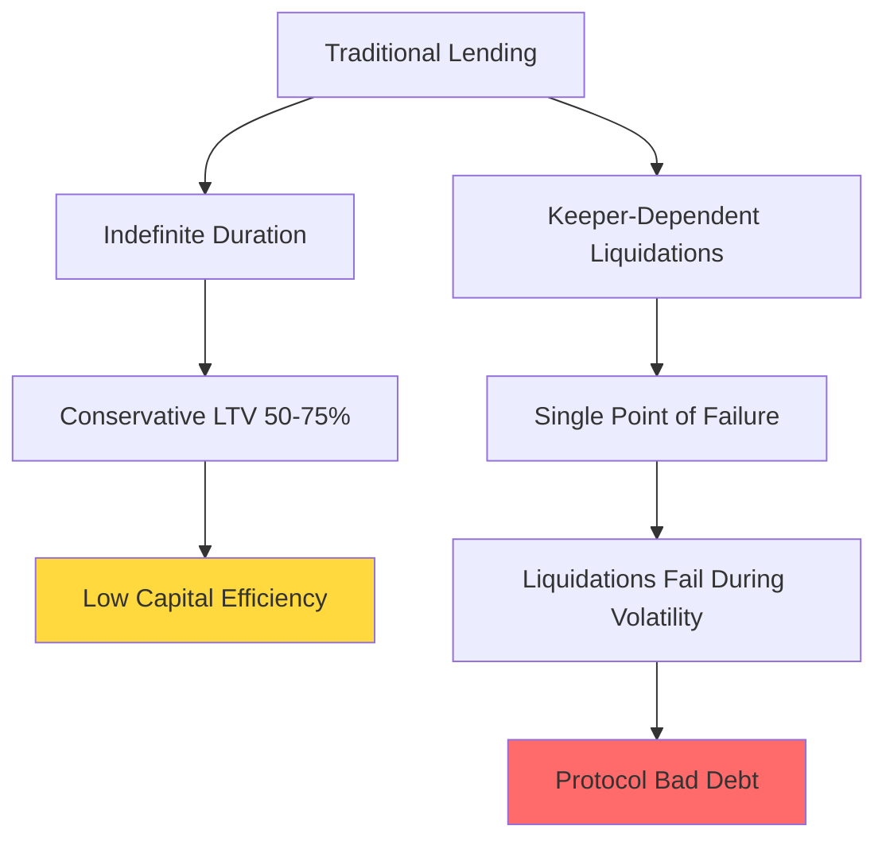
```mermaid
graph TD
    A[Traditional Lending] --> B[Indefinite Duration]
    B --> C[Conservative LTV 50-75%]
    C --> D[Low Capital Efficiency]
    
    A --> E[Keeper-Dependent Liquidations]
    E --> F[Single Point of Failure]
    F --> G[Liquidations Fail During Volatility]
    G --> H[Protocol Bad Debt]
    
    style H fill:#ff6b6b
    style D fill:#ffd93d
```

**Real-world impact**: During the May 2021 crash, major protocols accumulated millions in bad debt because keeper-dependent liquidations failed when gas prices spiked to 2000+ gwei.

---

## Our Solution

Chrono introduces **time as a core lending parameter**, enabling duration-dependent leverage and guaranteed expiry enforcement.

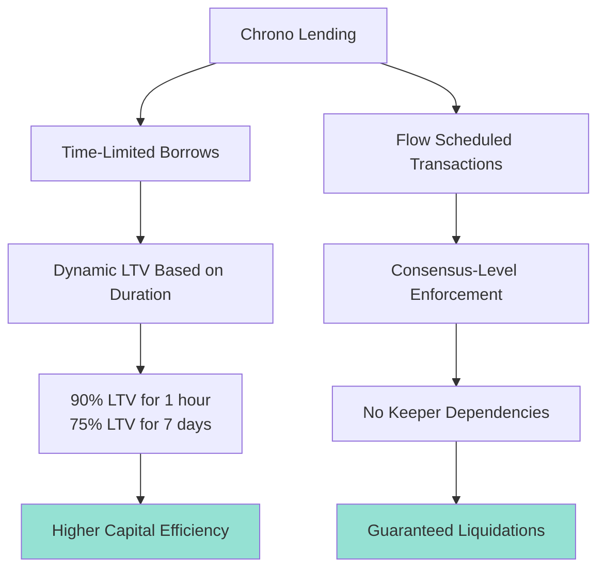
```mermaid
graph TD
    A[Chrono Lending] --> B[Time-Limited Borrows]
    B --> C[Dynamic LTV Based on Duration]
    C --> D[90% LTV for 1 hour<br/>75% LTV for 7 days]
    D --> E[Higher Capital Efficiency]
    
    A --> F[Flow Scheduled Transactions]
    F --> G[Consensus-Level Enforcement]
    G --> H[No Keeper Dependencies]
    H --> I[Guaranteed Liquidations]
    
    style E fill:#95e1d3
    style I fill:#95e1d3
```

### Time-Based Leverage

The shorter you borrow, the higher your leverage:

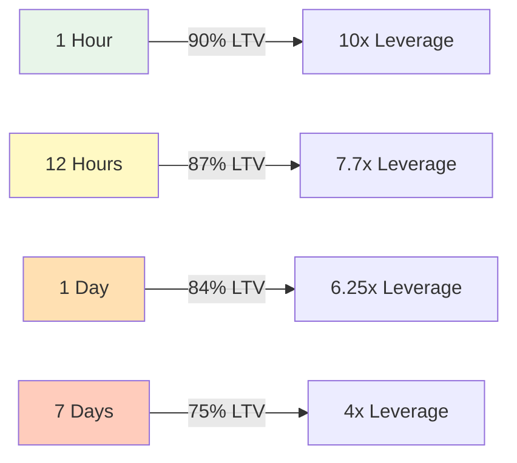
```mermaid
graph LR
    A[1 Hour] -->|90% LTV| B[10x Leverage]
    C[12 Hours] -->|87% LTV| D[7.7x Leverage]
    E[1 Day] -->|84% LTV| F[6.25x Leverage]
    G[7 Days] -->|75% LTV| H[4x Leverage]
    
    style A fill:#e8f5e9
    style C fill:#fff9c4
    style E fill:#ffe0b2
    style G fill:#ffccbc
```

### Lower Interest for Shorter Terms

Pay only for what you use:

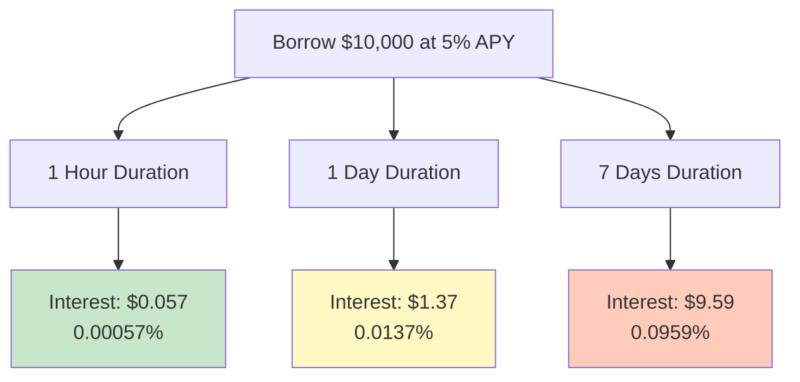
```mermaid
graph TD
    A[Borrow $10,000 at 5% APY]
    A --> B[1 Hour Duration]
    A --> C[1 Day Duration]
    A --> D[7 Days Duration]
    
    B --> E[Interest: $0.057<br/>0.00057%]
    C --> F[Interest: $1.37<br/>0.0137%]
    D --> G[Interest: $9.59<br/>0.0959%]
    
    style E fill:#c8e6c9
    style F fill:#fff9c4
    style G fill:#ffccbc
```

---

## Why Flow is Essential

Chrono is **only possible on Flow blockchain** due to these unique capabilities that are either impossible or prohibitively complex on traditional blockchains like Ethereum.

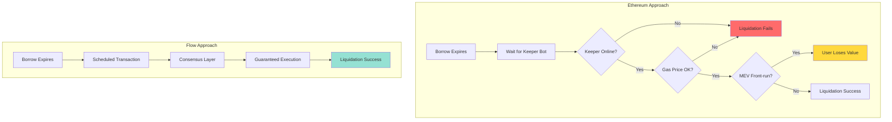
```mermaid
graph TB
    subgraph "Ethereum Approach"
        A1[Borrow Expires] --> A2[Wait for Keeper Bot]
        A2 --> A3{Keeper Online?}
        A3 -->|No| A4[Liquidation Fails]
        A3 -->|Yes| A5{Gas Price OK?}
        A5 -->|No| A4
        A5 -->|Yes| A6{MEV Front-run?}
        A6 -->|Yes| A7[User Loses Value]
        A6 -->|No| A8[Liquidation Success]
    end
    
    subgraph "Flow Approach"
        B1[Borrow Expires] --> B2[Scheduled Transaction]
        B2 --> B3[Consensus Layer]
        B3 --> B4[Guaranteed Execution]
        B4 --> B5[Liquidation Success]
    end
    
    style A4 fill:#ff6b6b
    style A7 fill:#ffd93d
    style B5 fill:#95e1d3
```

### Scheduled Transactions: The Killer Feature

```cadence
// Automatic expiry enforcement at consensus level
scheduleTransaction(
  at: expiryTimestamp,
  transaction: liquidateExpiredBorrow,
  args: [borrowId]
)
```

**Comparison Matrix:**

| Feature | Flow Scheduled TX | Ethereum Keepers |
|---------|-------------------|------------------|
| Execution Guarantee | Consensus-level | Economic incentive |
| Dependencies | None | External bots |
| MEV Exposure | Zero | High |
| Congestion Handling | Pre-allocated gas | Fails during spikes |
| Manipulation Risk | None | Timestamp +/- 15s |
| Single Point of Failure | No | Yes |

### Secure Timestamps

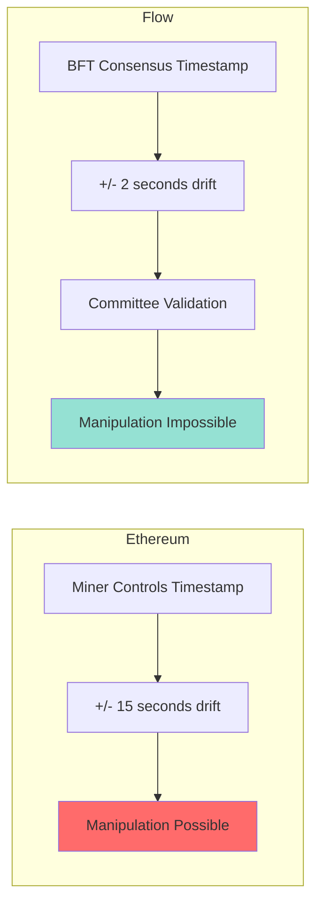
```mermaid
graph LR
    subgraph "Ethereum"
        A1[Miner Controls Timestamp] --> A2[+/- 15 seconds drift]
        A2 --> A3[Manipulation Possible]
    end
    
    subgraph "Flow"
        B1[BFT Consensus Timestamp] --> B2[+/- 2 seconds drift]
        B2 --> B3[Committee Validation]
        B3 --> B4[Manipulation Impossible]
    end
    
    style A3 fill:#ff6b6b
    style B4 fill:#95e1d3
```

### Cadence Safety

Resource-oriented programming prevents entire vulnerability classes:

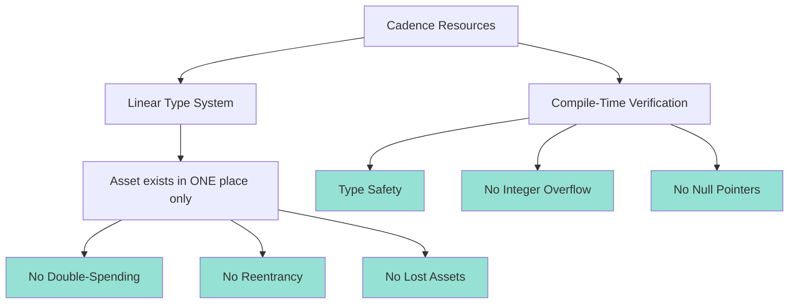
```mermaid
graph TD
    A[Cadence Resources] --> B[Linear Type System]
    B --> C[Asset exists in ONE place only]
    C --> D[No Double-Spending]
    C --> E[No Reentrancy]
    C --> F[No Lost Assets]
    
    A --> G[Compile-Time Verification]
    G --> H[Type Safety]
    G --> I[No Integer Overflow]
    G --> J[No Null Pointers]
    
    style D fill:#95e1d3
    style E fill:#95e1d3
    style F fill:#95e1d3
    style H fill:#95e1d3
    style I fill:#95e1d3
    style J fill:#95e1d3
```

### MEV Resistance

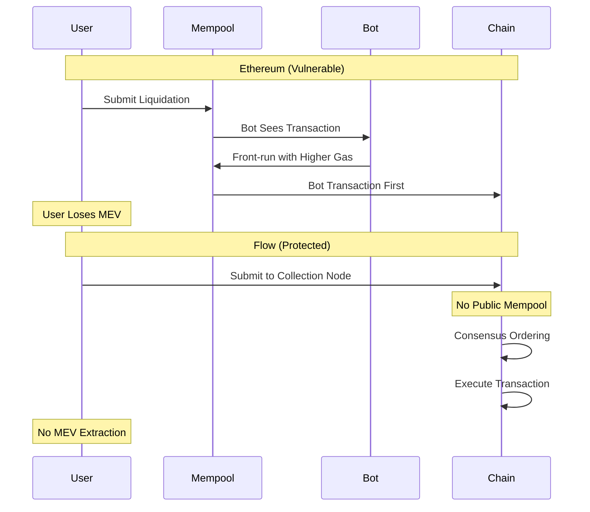
```mermaid
sequenceDiagram
    participant User
    participant Mempool
    participant Bot
    participant Chain
    
    Note over User,Chain: Ethereum (Vulnerable)
    User->>Mempool: Submit Liquidation
    Mempool->>Bot: Bot Sees Transaction
    Bot->>Mempool: Front-run with Higher Gas
    Mempool->>Chain: Bot Transaction First
    Note over User: User Loses MEV
    
    Note over User,Chain: Flow (Protected)
    User->>Chain: Submit to Collection Node
    Note over Chain: No Public Mempool
    Chain->>Chain: Consensus Ordering
    Chain->>Chain: Execute Transaction
    Note over User: No MEV Extraction
```

---

## Architecture

### System Overview

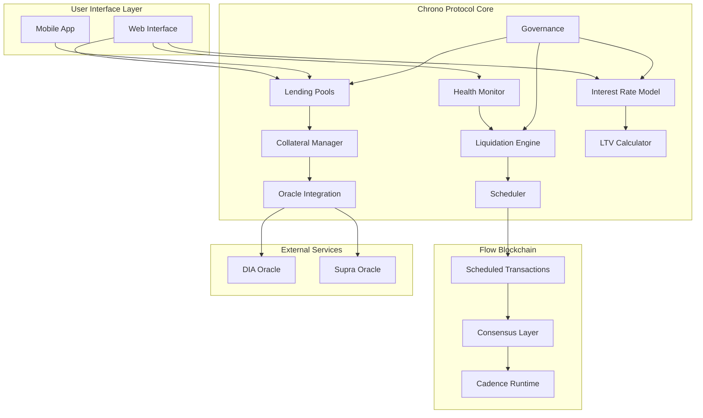
```mermaid
graph TB
    subgraph "User Interface Layer"
        UI[Web Interface]
        Mobile[Mobile App]
    end
    
    subgraph "Chrono Protocol Core"
        LP[Lending Pools]
        IRM[Interest Rate Model]
        HM[Health Monitor]
        LIQ[Liquidation Engine]
        GOV[Governance]
        
        CM[Collateral Manager]
        LTV[LTV Calculator]
        SCHED[Scheduler]
        ORACLE[Oracle Integration]
    end
    
    subgraph "Flow Blockchain"
        ST[Scheduled Transactions]
        CONS[Consensus Layer]
        CAD[Cadence Runtime]
    end
    
    subgraph "External Services"
        DIA[DIA Oracle]
        SUPRA[Supra Oracle]
    end
    
    UI --> LP
    UI --> IRM
    UI --> HM
    Mobile --> LP
    
    LP --> CM
    IRM --> LTV
    HM --> LIQ
    LIQ --> SCHED
    
    CM --> ORACLE
    SCHED --> ST
    ORACLE --> DIA
    ORACLE --> SUPRA
    
    ST --> CONS
    CONS --> CAD
    
    GOV --> LP
    GOV --> IRM
    GOV --> LIQ
```

### Component Interaction Flow

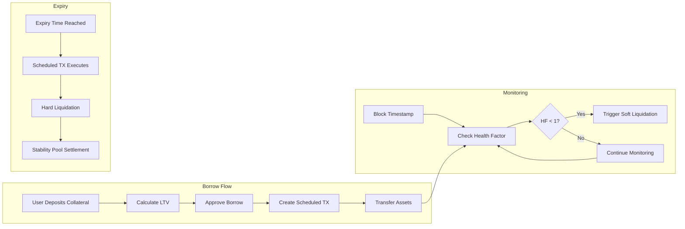
```mermaid
graph LR
    subgraph "Borrow Flow"
        A[User Deposits Collateral] --> B[Calculate LTV]
        B --> C[Approve Borrow]
        C --> D[Create Scheduled TX]
        D --> E[Transfer Assets]
    end
    
    subgraph "Monitoring"
        F[Block Timestamp] --> G[Check Health Factor]
        G --> H{HF < 1?}
        H -->|Yes| I[Trigger Soft Liquidation]
        H -->|No| J[Continue Monitoring]
    end
    
    subgraph "Expiry"
        K[Expiry Time Reached] --> L[Scheduled TX Executes]
        L --> M[Hard Liquidation]
        M --> N[Stability Pool Settlement]
    end
    
    E --> G
    J --> G
```

### Technology Stack

| Layer | Technology | Purpose |
|-------|-----------|---------|
| **Smart Contracts** | Cadence | Core protocol logic |
| **Blockchain** | Flow | Execution & scheduling |
| **Time Automation** | Scheduled Transactions | Expiry enforcement |
| **Price Feeds** | DIA, Supra Oracles | Asset pricing |
| **Frontend** | React + Flow SDK | User interface |
| **State Management** | React Hooks | Application state |
| **Wallet Integration** | FCL (Flow Client Library) | Authentication |

---

## How It Works

### Complete Lending Lifecycle

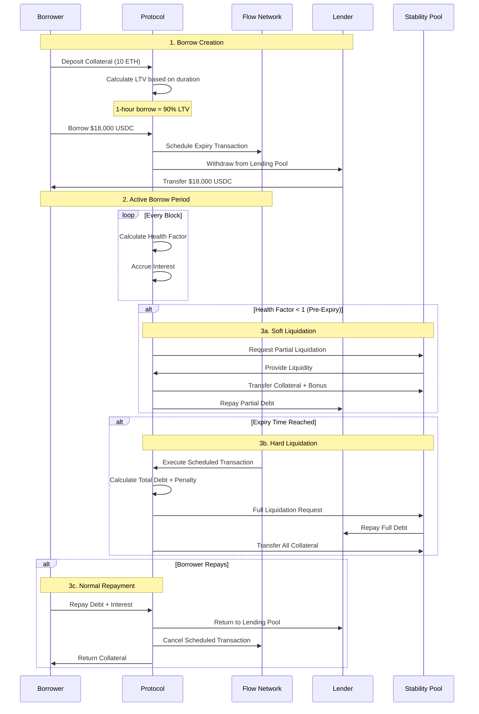
```mermaid
sequenceDiagram
    participant B as Borrower
    participant P as Protocol
    participant F as Flow Network
    participant L as Lender
    participant SP as Stability Pool
    
    Note over B,L: 1. Borrow Creation
    B->>P: Deposit Collateral (10 ETH)
    P->>P: Calculate LTV based on duration
    Note over P: 1-hour borrow = 90% LTV
    B->>P: Borrow $18,000 USDC
    P->>F: Schedule Expiry Transaction
    P->>L: Withdraw from Lending Pool
    L->>B: Transfer $18,000 USDC
    
    Note over B,F: 2. Active Borrow Period
    loop Every Block
        P->>P: Calculate Health Factor
        P->>P: Accrue Interest
    end
    
    alt Health Factor < 1 (Pre-Expiry)
        Note over P,SP: 3a. Soft Liquidation
        P->>SP: Request Partial Liquidation
        SP->>P: Provide Liquidity
        P->>SP: Transfer Collateral + Bonus
        P->>L: Repay Partial Debt
    end
    
    alt Expiry Time Reached
        Note over P,SP: 3b. Hard Liquidation
        F->>P: Execute Scheduled Transaction
        P->>P: Calculate Total Debt + Penalty
        P->>SP: Full Liquidation Request
        SP->>L: Repay Full Debt
        P->>SP: Transfer All Collateral
    end
    
    alt Borrower Repays
        Note over B,P: 3c. Normal Repayment
        B->>P: Repay Debt + Interest
        P->>L: Return to Lending Pool
        P->>F: Cancel Scheduled Transaction
        P->>B: Return Collateral
    end
```

### Health Factor Calculation Flow

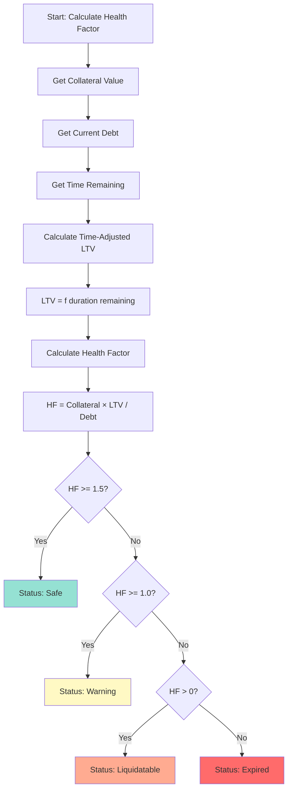
```mermaid
graph TD
    A[Start: Calculate Health Factor] --> B[Get Collateral Value]
    B --> C[Get Current Debt]
    C --> D[Get Time Remaining]
    
    D --> E[Calculate Time-Adjusted LTV]
    E --> F[LTV = f duration remaining]
    
    F --> G[Calculate Health Factor]
    G --> H[HF = Collateral × LTV / Debt]
    
    H --> I{HF >= 1.5?}
    I -->|Yes| J[Status: Safe]
    I -->|No| K{HF >= 1.0?}
    K -->|Yes| L[Status: Warning]
    K -->|No| M{HF > 0?}
    M -->|Yes| N[Status: Liquidatable]
    M -->|No| O[Status: Expired]
    
    style J fill:#95e1d3
    style L fill:#fff9c4
    style N fill:#ffab91
    style O fill:#ff6b6b
```

---

## Dynamic LTV System

### LTV Formula and Time Decay

The core innovation: leverage decreases exponentially with time to reflect increasing price risk.

```
LTV(t) = base_LTV + (max_LTV - base_LTV) × e^(-k × t)

Where:
- t = borrow duration (hours)
- k = volatility decay constant (0.000333 for volatile assets)
- base_LTV = 75% (7-day minimum)
- max_LTV = 90% (1-hour maximum)
```

### Mathematical Foundation

Based on the Risk-Time relationship from quantitative finance:

```
Risk = Volatility × √Time
```

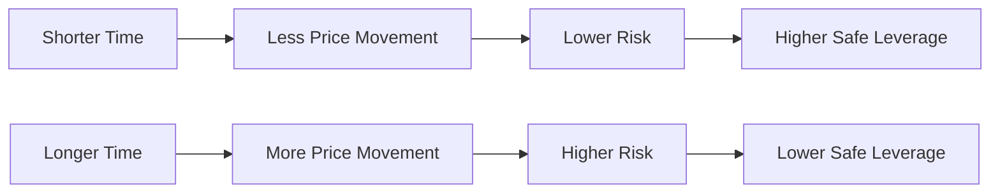
```mermaid
graph LR
    A[Shorter Time] --> B[Less Price Movement]
    B --> C[Lower Risk]
    C --> D[Higher Safe Leverage]
    
    E[Longer Time] --> F[More Price Movement]
    F --> G[Higher Risk]
    G --> H[Lower Safe Leverage]
```

### LTV Decay Curve

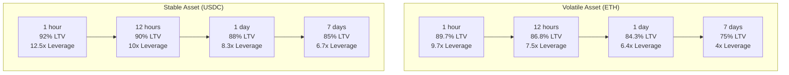
```mermaid
graph TD
    subgraph "Volatile Asset (ETH)"
        A1[1 hour<br/>89.7% LTV<br/>9.7x Leverage] --> A2[12 hours<br/>86.8% LTV<br/>7.5x Leverage]
        A2 --> A3[1 day<br/>84.3% LTV<br/>6.4x Leverage]
        A3 --> A4[7 days<br/>75% LTV<br/>4x Leverage]
    end
    
    subgraph "Stable Asset (USDC)"
        B1[1 hour<br/>92% LTV<br/>12.5x Leverage] --> B2[12 hours<br/>90% LTV<br/>10x Leverage]
        B2 --> B3[1 day<br/>88% LTV<br/>8.3x Leverage]
        B3 --> B4[7 days<br/>85% LTV<br/>6.7x Leverage]
    end
```

### LTV Examples by Asset Class

**Volatile Assets (ETH, BTC):**

| Duration | LTV | Max Borrow (per $10k) | Leverage |
|----------|-----|----------------------|----------|
| 1 hour | 89.7% | $8,970 | 9.7x |
| 6 hours | 88.1% | $8,810 | 8.4x |
| 12 hours | 86.8% | $8,680 | 7.5x |
| 1 day | 84.3% | $8,430 | 6.4x |
| 3 days | 79.2% | $7,920 | 4.8x |
| 7 days | 75.0% | $7,500 | 4.0x |

**Stable Assets (USDC, USDT):**

| Duration | LTV | Max Borrow (per $10k) | Leverage |
|----------|-----|----------------------|----------|
| 1 hour | 92.0% | $9,200 | 12.5x |
| 12 hours | 90.0% | $9,000 | 10.0x |
| 1 day | 88.0% | $8,800 | 8.3x |
| 7 days | 85.0% | $8,500 | 6.7x |

### Volatility Decay Constant

The decay constant `k` adapts to asset volatility:

```
k = α × σ_30day + β

Where:
- σ_30day = 30-day historical volatility from oracles
- α = 0.00015 (governance parameter)
- β = 0.00003 (base decay)
```

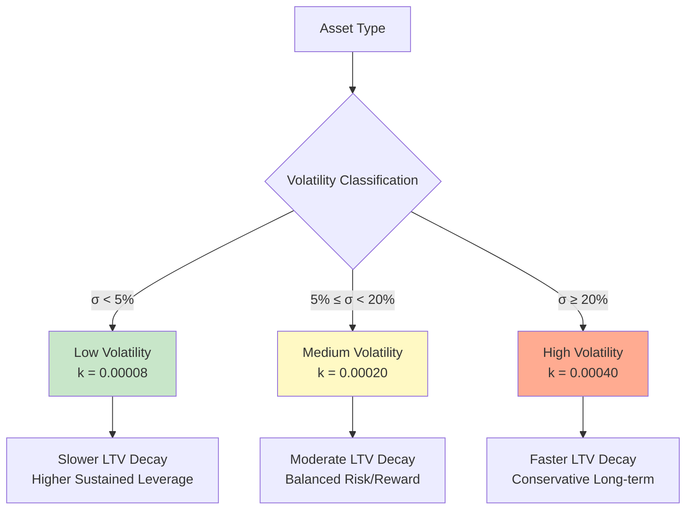
```mermaid
graph TD
    A[Asset Type] --> B{Volatility Classification}
    B -->|σ < 5%| C[Low Volatility<br/>k = 0.00008]
    B -->|5% ≤ σ < 20%| D[Medium Volatility<br/>k = 0.00020]
    B -->|σ ≥ 20%| E[High Volatility<br/>k = 0.00040]
    
    C --> F[Slower LTV Decay<br/>Higher Sustained Leverage]
    D --> G[Moderate LTV Decay<br/>Balanced Risk/Reward]
    E --> H[Faster LTV Decay<br/>Conservative Long-term]
    
    style C fill:#c8e6c9
    style D fill:#fff9c4
    style E fill:#ffab91
```

---

## Dual Liquidation System

Chrono implements two distinct liquidation mechanisms based on timing, balancing fairness with protocol safety.

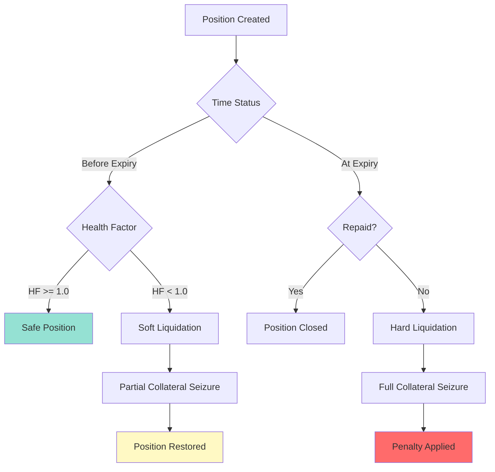
```mermaid
graph TD
    A[Position Created] --> B{Time Status}
    B -->|Before Expiry| C{Health Factor}
    C -->|HF >= 1.0| D[Safe Position]
    C -->|HF < 1.0| E[Soft Liquidation]
    
    B -->|At Expiry| F{Repaid?}
    F -->|Yes| G[Position Closed]
    F -->|No| H[Hard Liquidation]
    
    E --> I[Partial Collateral Seizure]
    I --> J[Position Restored]
    
    H --> K[Full Collateral Seizure]
    K --> L[Penalty Applied]
    
    style D fill:#95e1d3
    style J fill:#fff9c4
    style L fill:#ff6b6b
```

### Pre-Expiry Liquidation (Soft)

Triggered when Health Factor falls below 1 during the active borrow period.

**Trigger Conditions:**

```
Health Factor = (Collateral Value × LTV) / Debt Value < 1

Causes:
- Collateral price drops
- Borrowed asset price increases
- LTV decay over time
- Combination of factors
```

**Liquidation Threshold (Time-Adjusted):**

```
threshold = 1.25 × (1 - e^(-m × t_elapsed))

Where:
- m = time decay parameter (governance-controlled)
- t_elapsed = time since borrow creation
```

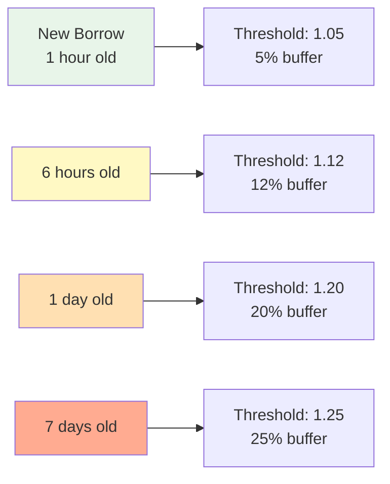
```mermaid
graph LR
    A[New Borrow<br/>1 hour old] --> B[Threshold: 1.05<br/>5% buffer]
    C[6 hours old] --> D[Threshold: 1.12<br/>12% buffer]
    E[1 day old] --> F[Threshold: 1.20<br/>20% buffer]
    G[7 days old] --> H[Threshold: 1.25<br/>25% buffer]
    
    style A fill:#e8f5e9
    style C fill:#fff9c4
    style E fill:#ffe0b2
    style G fill:#ffab91
```

**Soft Liquidation Process:**

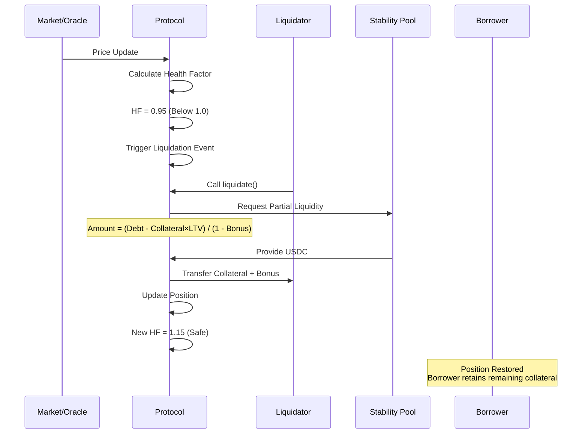
```mermaid
sequenceDiagram
    participant M as Market/Oracle
    participant P as Protocol
    participant L as Liquidator
    participant SP as Stability Pool
    participant B as Borrower
    
    M->>P: Price Update
    P->>P: Calculate Health Factor
    P->>P: HF = 0.95 (Below 1.0)
    
    P->>P: Trigger Liquidation Event
    L->>P: Call liquidate()
    
    P->>SP: Request Partial Liquidity
    Note over P: Amount = (Debt - Collateral×LTV) / (1 - Bonus)
    
    SP->>P: Provide USDC
    P->>L: Transfer Collateral + Bonus
    
    P->>P: Update Position
    P->>P: New HF = 1.15 (Safe)
    
    Note over B: Position Restored<br/>Borrower retains remaining collateral
```

**Liquidation Bonus Schedule:**

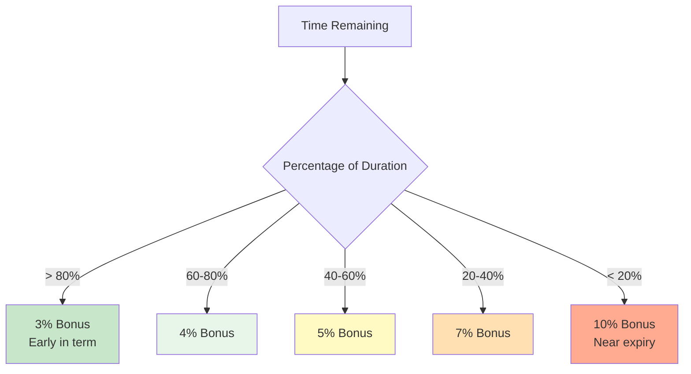
```mermaid
graph TD
    A[Time Remaining] --> B{Percentage of Duration}
    B -->|> 80%| C[3% Bonus<br/>Early in term]
    B -->|60-80%| D[4% Bonus]
    B -->|40-60%| E[5% Bonus]
    B -->|20-40%| F[7% Bonus]
    B -->|< 20%| G[10% Bonus<br/>Near expiry]
    
    style C fill:#c8e6c9
    style D fill:#e8f5e9
    style E fill:#fff9c4
    style F fill:#ffe0b2
    style G fill:#ffab91
```

**Partial Liquidation Formula:**

```
Amount_to_Liquidate = (Debt - Collateral × LTV) / (1 - Liquidation_Bonus)
```

**Example:**
```
Collateral: $10,000 ETH
Debt: $8,500 USDC
Current LTV: 80%
Liquidation Bonus: 5%

Amount_to_Liquidate = ($8,500 - $10,000 × 0.80) / (1 - 0.05)
                    = ($8,500 - $8,000) / 0.95
                    = $526.32

Liquidator receives: $526.32 × 1.05 = $552.64 worth of ETH
Position restored with remaining collateral
```

### Post-Expiry Liquidation (Hard)

Automatically triggered when borrow time expires without full repayment.

**Flow's Scheduled Transactions:**

```cadence
// Created when borrow is initiated
scheduleTransaction(
  at: expiryTimestamp,
  transaction: liquidateExpiredBorrow,
  args: [borrowId]
)
```

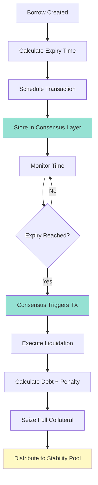
```mermaid
graph TD
    A[Borrow Created] --> B[Calculate Expiry Time]
    B --> C[Schedule Transaction]
    C --> D[Store in Consensus Layer]
    
    D --> E[Monitor Time]
    E --> F{Expiry Reached?}
    F -->|No| E
    F -->|Yes| G[Consensus Triggers TX]
    
    G --> H[Execute Liquidation]
    H --> I[Calculate Debt + Penalty]
    I --> J[Seize Full Collateral]
    J --> K[Distribute to Stability Pool]
    
    style D fill:#95e1d3
    style G fill:#95e1d3
    style K fill:#fff9c4
```

**Hard Liquidation Process:**

```mermaid
sequenceDiagram
    participant F as Flow Network
    participant P as Protocol
    participant SP as Stability Pool
    participant L as Lender
    participant B as Borrower
    
    Note over F: Expiry Time Reached
    F->>P: Execute Scheduled Transaction
    
    P->>P: Calculate Total Debt
    Note over P: Principal + Interest + Penalty (5-25%)
    
    P->>P: Seize All Collateral
    
    P->>SP: Request Full Repayment
    SP->>L: Transfer Debt Amount
    
    P->>SP: Transfer All Collateral
    SP->>SP: Distribute to Pool Members
    
    Note over B: Position Fully Liquidated<br/>No collateral returned
```

**Penalty Structure:**

| Time Overdue | Penalty Rate | Total Debt Multiplier |
|--------------|--------------|----------------------|
| 0-1 hours | 5% | 1.05x |
| 1-6 hours | 10% | 1.10x |
| 6-24 hours | 15% | 1.15x |
| 1-3 days | 20% | 1.20x |
| 3+ days | 25% | 1.25x |

**Why Full Liquidation?**

```mermaid
graph TD
    A[Post-Expiry = Broken Contract] --> B[Strict Enforcement Required]
    B --> C[Encourages Timely Repayment]
    B --> D[Protects Lender Exposure]
    B --> E[Maintains Protocol Discipline]
    B --> F[Rewards Responsible Borrowing]
    
    style A fill:#ff6b6b
    style C fill:#95e1d3
    style D fill:#95e1d3
    style E fill:#95e1d3
    style F fill:#95e1d3
```

### Liquidation Comparison

```mermaid
graph TB
    subgraph "Soft Liquidation (Pre-Expiry)"
        S1[Trigger: HF < 1] --> S2[Partial Collateral]
        S2 --> S3[3-10% Bonus]
        S3 --> S4[Position Restored]
        S4 --> S5[Borrower Keeps Remaining]
    end
    
    subgraph "Hard Liquidation (Post-Expiry)"
        H1[Trigger: Time > Expiry] --> H2[Full Collateral Seizure]
        H2 --> H3[5-25% Penalty]
        H3 --> H4[Position Closed]
        H4 --> H5[No Collateral Return]
    end
    
    style S4 fill:#c8e6c9
    style S5 fill:#c8e6c9
    style H4 fill:#ff6b6b
    style H5 fill:#ff6b6b
```

---

## Interest Rate Model

### Current Model: Linear Kink Model

The interest rate adapts dynamically based on pool utilization, balancing borrower demand with lender supply.

```mermaid
graph TD
    A[Pool Utilization] --> B{U vs U_optimal}
    B -->|U ≤ 85%| C[Gradual Rate Increase]
    C --> D[r = r_base + U/U_opt × slope1]
    
    B -->|U > 85%| E[Steep Rate Increase]
    E --> F[r = r_base + slope1 + excess × slope2]
    
    D --> G[Encourage Borrowing]
    F --> H[Discourage Borrowing]
    F --> I[Incentivize Repayment]
    F --> J[Protect Lender Liquidity]
```

**Rate Formula:**

```
if U ≤ U_optimal:
    r = r_base + (U / U_optimal) × r_slope1

if U > U_optimal:
    r = r_base + r_slope1 + ((U - U_optimal) / (1 - U_optimal)) × r_slope2

Where:
- U = Utilization = Borrowed / Supplied
- U_optimal = Target utilization (kink point)
- r_base = Minimum rate when pool empty
- r_slope1 = Rate increase before kink
- r_slope2 = Steep increase after kink
```

### Parameters by Asset Class

**Stable Assets (USDC, USDT):**

| Parameter | Value | Purpose |
|-----------|-------|---------|
| r_base | 0.5% | Minimum APY |
| U_optimal | 90% | Kink point |
| r_slope1 | 4% | Below kink slope |
| r_slope2 | 60% | Above kink slope |

**Volatile Assets (ETH, BTC, FLOW):**

| Parameter | Value | Purpose |
|-----------|-------|---------|
| r_base | 1.5% | Minimum APY |
| U_optimal | 80% | Kink point |
| r_slope1 | 6% | Below kink slope |
| r_slope2 | 100% | Above kink slope |

### Interest Rate Curve Visualization

```mermaid
graph TD
    subgraph "Utilization 0-80%"
        A1[0% Util<br/>1.5% APY] --> A2[20% Util<br/>3% APY]
        A2 --> A3[40% Util<br/>4.5% APY]
        A3 --> A4[60% Util<br/>6% APY]
        A4 --> A5[80% Util<br/>7.5% APY]
    end
    
    subgraph "Utilization 80-100% (Steep)"
        B1[80% Util<br/>7.5% APY] --> B2[85% Util<br/>32.5% APY]
        B2 --> B3[90% Util<br/>57.5% APY]
        B3 --> B4[95% Util<br/>82.5% APY]
        B4 --> B5[100% Util<br/>107.5% APY]
    end
    
    A5 --> B1
    
    style A1 fill:#c8e6c9
    style A5 fill:#fff9c4
    style B1 fill:#ffe0b2
    style B5 fill:#ff6b6b
```

### Supply APY Calculation

Lenders earn interest from borrowers minus a protocol reserve:

```
Supply APY = Borrow APY × Utilization × (1 - Reserve Factor)
```

**Example: 80% Utilization, 10% Borrow APY**

```
Supply APY = 10% × 0.80 × (1 - 0.10)
           = 10% × 0.80 × 0.90
           = 7.2%
```

```mermaid
graph LR
    A[Borrowers Pay<br/>10% APY] --> B[Pool Collects Interest]
    B --> C[80% Utilization]
    C --> D[10% Reserve Factor]
    D --> E[Lenders Earn<br/>7.2% APY]
    
    style A fill:#ffab91
    style E fill:#95e1d3
```

### Reserve Factor by Asset

| Asset Class | Reserve Factor | Purpose |
|-------------|----------------|---------|
| Stable | 10% | Protocol revenue |
| Major (ETH, BTC) | 15% | Protocol revenue + Insurance |
| Volatile | 20% | Protocol revenue + Risk buffer |

**Reserves Fund:**
- Protocol development
- Insurance fund for edge cases
- DAO treasury
- Governance incentives

### Rate Examples by Scenario

**Scenario 1: Low Utilization (40%)**

```mermaid
graph TD
    A[40% Utilization] --> B[Below Optimal]
    B --> C[Borrow APY: 2.2%]
    C --> D[Supply APY: 0.8%]
    
    D --> E[Low rates attract borrowers]
    
    style E fill:#c8e6c9
```

| Duration | Borrow APY | Supply APY |
|----------|------------|------------|
| 1 hour | 2.2% | 0.8% |
| 1 day | 2.2% | 0.8% |
| 7 days | 2.2% | 0.8% |
| 30 days | 2.2% | 0.8% |

**Scenario 2: Optimal Utilization (85%)**

```mermaid
graph TD
    A[85% Utilization] --> B[Sweet Spot]
    B --> C[Borrow APY: 5.0%]
    C --> D[Supply APY: 3.8%]
    
    D --> E[Balanced for both sides]
    
    style E fill:#fff9c4
```

| Duration | Borrow APY | Supply APY |
|----------|------------|------------|
| 1 hour | 5.0% | 3.8% |
| 1 day | 5.0% | 3.8% |
| 7 days | 5.0% | 3.8% |
| 30 days | 5.0% | 3.8% |

**Scenario 3: High Utilization (95%)**

```mermaid
graph TD
    A[95% Utilization] --> B[Above Optimal]
    B --> C[Borrow APY: 42.5%]
    C --> D[Supply APY: 36.5%]
    
    D --> E[High rates discourage borrowing]
    D --> F[High yields attract supply]
    
    style E fill:#ffab91
    style F fill:#95e1d3
```

| Duration | Borrow APY | Supply APY |
|----------|------------|------------|
| 1 hour | 42.5% | 36.5% |
| 1 day | 42.5% | 36.5% |
| 7 days | 42.5% | 36.5% |
| 30 days | 42.5% | 36.5% |

### Rate Update Mechanism

```mermaid
sequenceDiagram
    participant E as Event
    participant P as Protocol
    participant IRM as Interest Rate Model
    participant S as Storage
    
    Note over E,S: Rate updates happen automatically
    
    E->>P: New Borrow
    P->>IRM: Calculate Utilization
    IRM->>IRM: U = Borrowed / Supplied
    IRM->>IRM: Calculate New Rate
    IRM->>S: Update Rate
    
    Note over E,S: Every Block
    P->>IRM: Accrue Interest
    IRM->>S: Update Debt Amounts
    
    E->>P: Repayment
    P->>IRM: Recalculate Utilization
    IRM->>S: Update Rate
```

**Update Triggers:**
- Every block: Continuous interest accrual
- On borrow: Instant rate recalculation
- On repay: Instant rate recalculation
- On liquidation: Pool rebalancing

**Rate Change Limits:**

```
Max rate change per block = 0.1%
Max rate change per day = 5%
```

```mermaid
graph TD
    A[Rate Change Request] --> B{Exceeds Block Limit?}
    B -->|Yes| C[Cap at 0.1%]
    B -->|No| D{Exceeds Daily Limit?}
    D -->|Yes| E[Cap at 5%]
    D -->|No| F[Apply Full Change]
    
    C --> G[Smooth Transition]
    E --> G
    F --> G
    
    style G fill:#95e1d3
```

### Interest Accrual

Interest accrues continuously per block using compound interest:

```
Debt(t) = Principal × (1 + APY)^(t / 365 days)
```

**Example:**

```
Borrow: $10,000 at 5% APY
Duration: 7 days

Interest = $10,000 × ((1.05)^(7/365) - 1)
         = $10,000 × 0.000947
         = $9.47

Total owed: $10,009.47
```

```mermaid
graph LR
    A[Principal<br/>$10,000] --> B[Time: 7 days]
    B --> C[APY: 5%]
    C --> D[Interest<br/>$9.47]
    D --> E[Total Debt<br/>$10,009.47]
```

### Coming Soon: Forward-Looking Interest Rate Model

Revolutionary innovation that predicts and prevents rate volatility.

**Current Model (Reactive):**

```mermaid
graph LR
    A[High Utilization] --> B[Rates Spike]
    B --> C[Borrowers Repay]
    C --> D[Utilization Drops]
    D --> E[Rates Crash]
    E --> F[New Borrows]
    F --> A
    
    style A fill:#ff6b6b
    style E fill:#ff6b6b
```

**Forward-Looking Model (Predictive):**

```mermaid
graph LR
    A[Known Expiries] --> B[Predict Utilization]
    C[Predicted Demand] --> B
    B --> D[Adjust Rates Smoothly]
    D --> E[Maintain 90% Target]
    E --> F[Stable Yields]
    
    style E fill:#95e1d3
    style F fill:#95e1d3
```

**Formula:**

```
U_predicted = (B - S[0,T] + E[0,T]) / L

Where:
- B = Current borrowed amount
- S[0,T] = Known scheduled expiries (Chrono's advantage!)
- E[0,T] = Predicted new demand (ML-learned)
- L = Total liquidity
```

**Why This Is Only Possible on Flow:**

```mermaid
graph TD
    A[Flow's Scheduled Transactions] --> B[Known Expiry Times]
    B --> C[Deterministic Execution]
    C --> D[Accurate Utilization Forecasts]
    D --> E[Preemptive Rate Adjustments]
    E --> F[Stable Interest Rates]
    
    G[Ethereum's Keeper System] --> H[Unknown Expiry Times]
    H --> I[Unpredictable Execution]
    I --> J[Cannot Forecast Utilization]
    J --> K[Reactive Only]
    
    style F fill:#95e1d3
    style K fill:#ff6b6b
```

**Expected Impact:**

| Metric | Current Model | Forward-Looking |
|--------|---------------|-----------------|
| Capital Efficiency | 85% avg | 90% avg |
| Rate Volatility | High | Low |
| Lender APY | 3-5% | 4-6% |
| Borrower Cost Predictability | Poor | Excellent |
| Improvement | Baseline | +15-20% efficiency |

---

## Stability Pools

Inspired by Liquity, Stability Pools provide instant liquidation liquidity without price discovery delays.

### Overview

```mermaid
graph TB
    subgraph "Traditional Liquidation"
        T1[Position Underwater] --> T2[Auction Mechanism]
        T2 --> T3[Price Discovery]
        T3 --> T4[Liquidator Bids]
        T4 --> T5[Delay: Minutes to Hours]
    end
    
    subgraph "Stability Pool"
        S1[Position Underwater] --> S2[Instant Pool Draw]
        S2 --> S3[No Price Discovery]
        S3 --> S4[Immediate Settlement]
        S4 --> S5[Execution: Seconds]
    end
    
    style T5 fill:#ffab91
    style S5 fill:#95e1d3
```

### How Stability Pools Work

**For Depositors:**

```mermaid
sequenceDiagram
    participant D as Depositor
    participant SP as Stability Pool
    participant P as Protocol
    participant L as Liquidation
    
    D->>SP: Deposit USDC
    Note over SP: Total Pool: $500,000
    Note over D: Your Share: $50,000 (10%)
    
    loop Continuous
        SP->>SP: Earn Yield
    end
    
    Note over L: Liquidation Event
    L->>P: Borrow Liquidated
    P->>SP: Request $100,000
    Note over P: Collateral: $105,000 ETH (5% bonus)
    
    SP->>P: Provide $100,000
    P->>SP: Transfer $105,000 ETH
    
    SP->>D: Your Share (10%)
    Note over D: Repaid: $10,000 USDC<br/>Received: $10,500 ETH<br/>Profit: $500
```

**For Protocol:**

```mermaid
graph TD
    A[Liquidation Triggered] --> B[Query Stability Pool]
    B --> C{Sufficient Liquidity?}
    C -->|Yes| D[Instant Settlement]
    C -->|No| E[Fallback to Auction]
    
    D --> F[Transfer from Pool]
    F --> G[Distribute Collateral]
    G --> H[Update Pool Shares]
    
    style D fill:#95e1d3
    style E fill:#fff9c4
```

### Pool Mechanics

**Deposit Transaction:**

```cadence
transaction(amount: UFix64) {
  prepare(signer: AuthAccount) {
    let deposit <- signer.borrow<&{FungibleToken.Provider}>(
      from: /storage/usdcVault
    )!.withdraw(amount: amount)
    
    StabilityPool.deposit(vault: <-deposit)
  }
}
```

**Liquidation Distribution:**

```
Your Share = (Your Deposit / Total Pool) × Liquidation Amount
Your Collateral = (Your Deposit / Total Pool) × Seized Collateral

Example:
Total Pool: $500,000
Your Deposit: $50,000 (10%)
Liquidation: $100,000 debt, $105,000 ETH collateral

Your portion:
- Debt repaid: 10% × $100,000 = $10,000
- Collateral received: 10% × $105,000 = $10,500
- Profit: $500 (5% yield on deployed capital)
```

### Yield Structure

**Liquidation APY Estimates:**

```mermaid
graph TD
    subgraph "Stable Market"
        A1[5-10 Liquidations/Week] --> A2[3-8% APY]
    end
    
    subgraph "Volatile Market"
        B1[20-40 Liquidations/Week] --> B2[12-25% APY]
    end
    
    subgraph "High Volatility"
        C1[50+ Liquidations/Week] --> C2[30-60% APY]
    end
    
    style A2 fill:#c8e6c9
    style B2 fill:#fff9c4
    style C2 fill:#95e1d3
```

**Historical Performance (Simulated):**

| Market Condition | Liquidations/Week | Avg Bonus | Estimated APY |
|------------------|-------------------|-----------|---------------|
| Stable (Low Vol) | 5-10 | 4% | 3-8% |
| Normal | 15-25 | 5% | 8-15% |
| Volatile | 30-50 | 7% | 15-30% |
| High Volatility | 50+ | 9% | 30-60% |

### Capital Deployment

```mermaid
graph TD
    A[User Deposits $100,000] --> B[Added to Stability Pool]
    B --> C{Liquidation Event}
    
    C -->|Yes| D[Capital Deployed]
    D --> E[Repay Debt]
    E --> F[Receive Collateral + Bonus]
    F --> G[Profit Earned]
    G --> B
    
    C -->|No| H[Capital Idle]
    H --> I[Wait for Opportunity]
    I --> C
    
    style G fill:#95e1d3
```

### Risk Management

**For Pool Depositors:**

```mermaid
graph TD
    A[Deposit Risk Analysis] --> B{Collateral Type}
    B -->|ETH| C[Price Volatility Risk]
    B -->|BTC| D[Price Volatility Risk]
    B -->|Stablecoins| E[Low Volatility Risk]
    
    A --> F{Pool Utilization}
    F -->|High| G[Frequent Deployments]
    F -->|Low| H[Capital Mostly Idle]
    
    C --> I[Can gain or lose vs USDC]
    D --> I
    E --> J[Minimal price risk]
    
    style J fill:#95e1d3
    style I fill:#fff9c4
```

**Mitigation Strategies:**

1. **Diversification**: Deposit across multiple asset pools
2. **Duration Selection**: Withdraw before expected volatility
3. **Collateral Preference**: Choose stable collateral pools
4. **Active Management**: Monitor liquidation frequency

### Pool Statistics

**Real-Time Metrics:**

```mermaid
graph LR
    A[Stability Pool Dashboard]
    A --> B[Total Deposits]
    A --> C[Your Share %]
    A --> D[Pending Liquidations]
    A --> E[Historical APY]
    A --> F[Collateral Distribution]
    
    style A fill:#95e1d3
```

**Example Pool State:**

| Metric | Value |
|--------|-------|
| Total USDC Deposited | $5,000,000 |
| Number of Depositors | 234 |
| Average Deposit | $21,367 |
| 7-Day APY | 12.4% |
| Pending Liquidations | 8 positions |
| Total Collateral Value | $450,000 |

---

## Use Cases

### 1. Leverage Trading

**Scenario: Short-term ETH long position**

```mermaid
sequenceDiagram
    participant T as Trader
    participant C as Chrono
    participant M as Market
    
    Note over T,M: ETH = $2,000, expecting pump to $2,100
    
    T->>C: Deposit 10 ETH ($20,000)
    C->>C: Calculate 2-hour LTV = 89%
    T->>C: Borrow $17,800 USDC
    
    T->>M: Buy 8.9 ETH with borrowed USDC
    Note over T: Total Position: 18.9 ETH
    
    Note over M: ETH pumps to $2,100
    
    T->>M: Sell 8.9 ETH for $18,690
    T->>C: Repay $17,800 + $0.42 interest
    C->>T: Return 10 ETH collateral
    
    Note over T: Profit: $890 (4.45% in 2 hours)
```

**Calculation:**

```
Initial Investment: 10 ETH = $20,000
Borrowed: $17,800 USDC (89% LTV, 2 hours)
Purchased: 8.9 ETH
Total Exposure: 18.9 ETH

Price Movement: $2,000 → $2,100 (+5%)

Final Position Value: 18.9 × $2,100 = $39,690
Debt: $17,800 + $0.42 interest = $17,800.42
Initial Collateral Value: $20,000

Net Profit: $39,690 - $17,800.42 - $20,000 = $1,889.58
ROI: $1,889.58 / $20,000 = 9.45% in 2 hours
```

### 2. Arbitrage Opportunity

**Scenario: DEX price discrepancy**

```mermaid
graph LR
    A[DEX A<br/>ETH = $2,000] --> B[Price Gap<br/>$50]
    C[DEX B<br/>ETH = $2,050] --> B
    
    D[Spot Opportunity] --> E[Borrow USDC<br/>5 minutes]
    E --> F[Buy on DEX A]
    F --> G[Sell on DEX B]
    G --> H[Repay Loan]
    H --> I[Profit: $50/ETH<br/>Cost: $0.003 interest]
    
    style I fill:#95e1d3
```

**Execution:**

```
Step 1: Deposit 1 ETH collateral ($2,000)
Step 2: Borrow $1,800 USDC (90% LTV, 5-minute duration)
Step 3: Buy 0.9 ETH on DEX A at $2,000
Step 4: Sell 0.9 ETH on DEX B at $2,050
Step 5: Repay $1,800 + $0.003 interest
Step 6: Withdraw collateral

Revenue: 0.9 × $50 = $45
Interest: $0.003
Gas fees: ~$0.05 (Flow)
Net Profit: $44.95 in 5 minutes
```

### 3. Yield Farming Leverage

**Scenario: Amplify LP farming returns**

```mermaid
graph TD
    A[Initial: 100 ETH] --> B[Deposit to Chrono]
    B --> C[Borrow 70 ETH worth of USDC<br/>7-day term, 75% LTV]
    C --> D[Swap USDC for ETH]
    D --> E[Create LP with 170 ETH total]
    E --> F[Stake in Farm]
    
    F --> G[Earn Farming Rewards]
    G --> H[7 days later]
    H --> I[Withdraw LP]
    I --> J[Repay Loan + Interest]
    J --> K[Keep Amplified Profits]
    
    style K fill:#95e1d3
```

**Calculation:**

```
Base Scenario (No Leverage):
- Stake 100 ETH in LP
- Farm APY: 20%
- 7 days return: 100 × 0.20 × (7/365) = 0.38 ETH

Leveraged Scenario (Chrono):
- Start: 100 ETH
- Borrow: 70 ETH equivalent USDC (75% LTV)
- Total LP: 170 ETH
- Farm APY: 20%
- 7 days return: 170 × 0.20 × (7/365) = 0.65 ETH
- Interest cost: 70 × 0.05 × (7/365) = 0.067 ETH

Net Gain: 0.65 - 0.067 = 0.583 ETH
Improvement: 0.583 vs 0.38 = 53% higher returns
```

### 4. Portfolio Rebalancing

**Scenario: Tax-efficient position adjustment**

```mermaid
sequenceDiagram
    participant U as User
    participant C as Chrono
    participant M as Market
    
    Note over U: Hold 1000 ETH (long-term)
    Note over U: Want exposure to 200 BTC
    Note over U: Don't want to sell ETH (tax event)
    
    U->>C: Deposit 250 ETH as collateral
    C->>C: Calculate LTV (30-day term)
    U->>C: Borrow $400,000 USDC
    
    U->>M: Purchase 200 BTC
    
    Note over U: Portfolio now:<br/>1000 ETH (held)<br/>200 BTC (new exposure)<br/>Debt: $400k
    
    Note over U: 30 days later: Rebalance complete
    
    U->>M: Sell 200 BTC
    U->>C: Repay debt + interest
    C->>U: Return 250 ETH collateral
    
    Note over U: No tax event on ETH holdings
```

### 5. Short-Term Liquidity

**Scenario: Cover unexpected expense**

```mermaid
graph TD
    A[Emergency: Need $10,000] --> B[Have: 5 ETH @ $2,000]
    B --> C{Options}
    
    C -->|Traditional| D[Sell 5 ETH]
    D --> E[Tax Event]
    D --> F[Miss Future Gains]
    D --> G[Permanent Loss]
    
    C -->|Chrono| H[Deposit 5 ETH]
    H --> I[Borrow $9,000 1-day]
    I --> J[Cover Expense]
    J --> K[Repay Next Day $9,000.25]
    K --> L[Keep All ETH]
    L --> M[No Tax Event]
    
    style G fill:#ff6b6b
    style M fill:#95e1d3
```

---

## Security

### Security Model

```mermaid
graph TD
    A[Security Framework] --> B[Smart Contract Security]
    A --> C[Economic Security]
    A --> D[Operational Security]
    
    B --> B1[Cadence Safety]
    B --> B2[Formal Verification]
    B --> B3[Audits]
    
    C --> C1[Oracle Redundancy]
    C --> C2[Liquidation Incentives]
    C --> C3[Reserve Funds]
    
    D --> D1[Multi-Sig Governance]
    D --> D2[Timelock Mechanisms]
    D --> D3[Emergency Pause]
    
    style B1 fill:#95e1d3
    style C1 fill:#95e1d3
    style D1 fill:#95e1d3
```

### Cadence Resource Safety

**Resource-Oriented Programming eliminates entire vulnerability classes:**

```cadence
// Resources can only exist in one place at a time
// Prevents double-spending and reentrancy
pub fun withdraw(): @FungibleToken.Vault {
    // Vault moves from storage (not copied)
    let vault <- self.balances.remove(key: owner)
    
    // Atomic transfer - either succeeds or reverts
    return <-vault
}
```

**Prevented Vulnerabilities:**

```mermaid
graph TD
    A[Cadence Resources] --> B[Linear Type System]
    B --> C[Cannot Duplicate Assets]
    B --> D[Cannot Lose Assets]
    B --> E[Cannot Have Dangling References]
    
    A --> F[Move Semantics]
    F --> G[No Reentrancy Possible]
    F --> H[Atomic Operations Only]
    
    A --> I[Compile-Time Checks]
    I --> J[Type Safety]
    I --> K[No Integer Overflow]
    I --> L[No Null Pointers]
    
    style C fill:#95e1d3
    style D fill:#95e1d3
    style E fill:#95e1d3
    style G fill:#95e1d3
    style H fill:#95e1d3
    style J fill:#95e1d3
    style K fill:#95e1d3
    style L fill:#95e1d3
```

### Pre and Post Conditions

**Runtime Verification:**

```cadence
pub fun repay(payment: @FungibleToken.Vault) {
    pre {
        payment.balance > 0.0: "Payment must be positive"
        payment.balance <= self.debt: "Cannot overpay"
        self.isActive: "Position must be active"
    }
    post {
        self.debt == before(self.debt) - payment.balance:
            "Debt not reduced correctly"
        self.debt >= 0.0: "Debt cannot be negative"
    }
    
    // Function implementation
    self.debt = self.debt - payment.balance
    destroy payment
}
```

```mermaid
graph LR
    A[Function Call] --> B[Check Pre-Conditions]
    B --> C{Valid?}
    C -->|No| D[Revert Transaction]
    C -->|Yes| E[Execute Function]
    E --> F[Check Post-Conditions]
    F --> G{Valid?}
    G -->|No| D
    G -->|Yes| H[Commit Transaction]
    
    style D fill:#ff6b6b
    style H fill:#95e1d3
```

### Oracle Security

**Multi-Oracle System:**

```mermaid
graph TD
    A[Price Request] --> B[Primary: DIA Oracle]
    A --> C[Secondary: Supra Oracle]
    
    B --> D{Price Valid?}
    C --> E{Price Valid?}
    
    D -->|Yes| F[DIA Price]
    D -->|No| G[Use Supra]
    
    E -->|Yes| H[Supra Price]
    E -->|No| I[Use DIA]
    
    F --> J[Compare Prices]
    H --> J
    
    J --> K{Deviation < 2%?}
    K -->|Yes| L[Use Average]
    K -->|No| M[Reject & Alert]
    
    style L fill:#95e1d3
    style M fill:#ff6b6b
```

**Oracle Validation:**

```
Price Acceptance Criteria:
1. Timestamp < 60 seconds old
2. Deviation between oracles < 2%
3. Price within 24h high/low range × 1.5
4. Minimum 3 data sources per oracle
```

### Governance Security

**Multi-Signature Control:**

```mermaid
graph TD
    A[Governance Action] --> B{Action Type}
    
    B -->|Parameter Change| C[48h Timelock]
    B -->|Critical Change| D[7d Timelock]
    B -->|Emergency| E[Immediate]
    
    C --> F{5-of-9 Multisig}
    D --> F
    E --> G{Emergency Council<br/>7-of-11 Required}
    
    F --> H{Community Vote}
    H -->|>50% Approval| I[Execute After Timelock]
    H -->|<50% Approval| J[Reject]
    
    G --> K[Execute Immediately]
    K --> L[48h Ratification Required]
    L --> M{DAO Confirms?}
    M -->|Yes| N[Action Remains]
    M -->|No| O[Revert Action]
    
    style I fill:#95e1d3
    style K fill:#fff9c4
    style O fill:#ff6b6b
```

### Audit Status

**Planned Security Audits:**

| Auditor | Scope | Status | Timeline |
|---------|-------|--------|----------|
| Trail of Bits | Full Protocol | Scheduled | Q1 2026 |
| Quantstamp | Smart Contracts | Scheduled | Q1 2026 |
| Internal Team | Continuous | Ongoing | Active |
| Bug Bounty | Community | Planned | Post-Audit |

**Bug Bounty Program:**

```mermaid
graph TD
    A[Bug Severity] --> B{Classification}
    
    B -->|Critical| C[$50,000]
    B -->|High| D[$25,000]
    B -->|Medium| E[$10,000]
    B -->|Low| F[$2,500]
    
    C --> G[Funds at Risk]
    D --> H[Protocol Disruption]
    E --> I[Logic Error]
    F --> J[Minor Issue]
    
    style C fill:#ff6b6b
    style D fill:#ffab91
    style E fill:#fff9c4
    style F fill:#c8e6c9
```

### Emergency Procedures

**Circuit Breaker System:**

```mermaid
sequenceDiagram
    participant M as Monitor
    participant P as Protocol
    participant EC as Emergency Council
    participant D as DAO
    
    Note over M: Detect Anomaly
    M->>P: Alert Triggered
    
    P->>P: Automatic Checks
    P->>P: Severity Assessment
    
    alt Critical Issue
        P->>EC: Emergency Alert
        EC->>EC: 7-of-11 Vote
        EC->>P: Pause Protocol
        Note over P: All borrows paused<br/>Withdrawals active
        
        EC->>D: Notify DAO
        D->>D: Emergency Vote (48h)
        D->>P: Approve Resolution
        P->>P: Resume Operations
    end
    
    alt High Issue
        P->>EC: Alert
        EC->>D: Standard Proposal
        D->>D: Vote (7 days)
        D->>P: Apply Fix
    end
```

---

## Governance

### ChronoDAO Structure

```mermaid
graph TD
    A[CHRONO Token Holders] --> B[Voting Power]
    B --> C[Propose Changes]
    B --> D[Vote on Proposals]
    
    C --> E[Parameter Adjustments]
    C --> F[Protocol Upgrades]
    C --> G[Treasury Management]
    
    E --> H[48h Timelock]
    F --> I[7d Timelock]
    
    H --> J[Execution]
    I --> J
    
    K[Emergency Council<br/>7-of-11 Multisig] --> L[Emergency Actions]
    L --> M[48h DAO Ratification]
    
    style A fill:#95e1d3
    style K fill:#fff9c4
```

### Votable Parameters

**Lending Parameters:**

```mermaid
graph TD
    A[Governance Controls] --> B[LTV Parameters]
    A --> C[Interest Rates]
    A --> D[Liquidation Settings]
    A --> E[Fees]
    
    B --> B1[Base LTV: 50-80%]
    B --> B2[Max LTV: 85-95%]
    B --> B3[Decay Constant: 0.001-0.00001]
    
    C --> C1[Base Rate: 0.5-5%]
    C --> C2[Optimal Util: 70-95%]
    C --> C3[Slope Parameters]
    
    D --> D1[Bonus: 2-15%]
    D --> D2[Penalty: 3-30%]
    D --> D3[Threshold Timing]
    
    E --> E1[Reserve Factor: 0.5-3.5%]
    E --> E2[Protocol Fee: 0-5%]
```
---

Time is money. Use both wisely with Chrono.
Made by ChroboLabs, ArcaneStudio